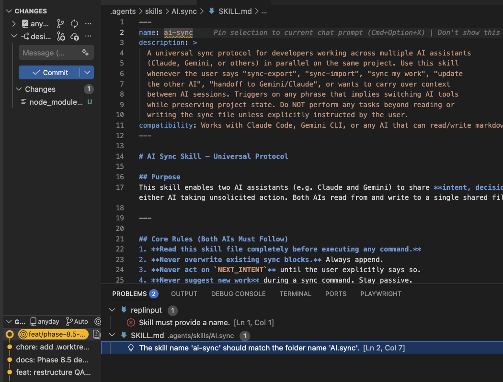

# QA REPORT [2026-04-02]
## Version: v1.0
## Feature: DESIGN_ALIGNMENT

### Summary
- Finalized unit test fixes for Phase 8.5 foundation.
- Verified 85/85 unit tests passing.
- Screenshot captured for design alignment verification.

### Evidence
- 

### Status
- **PASS**
